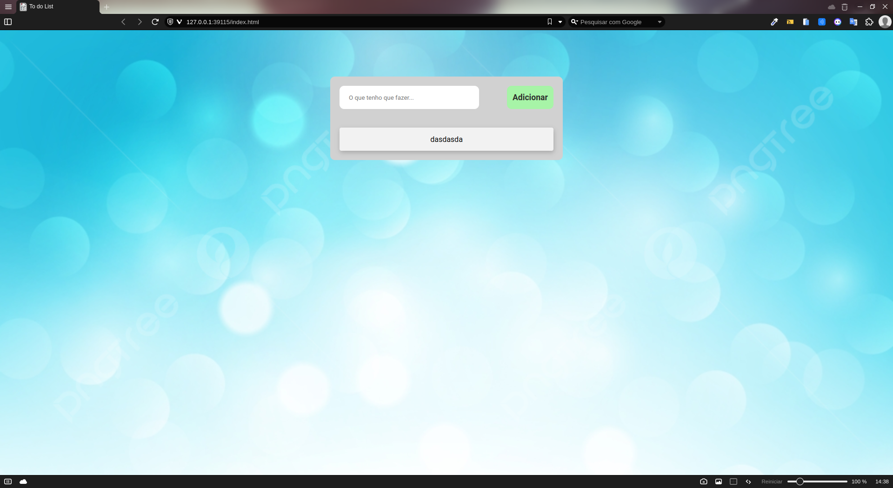
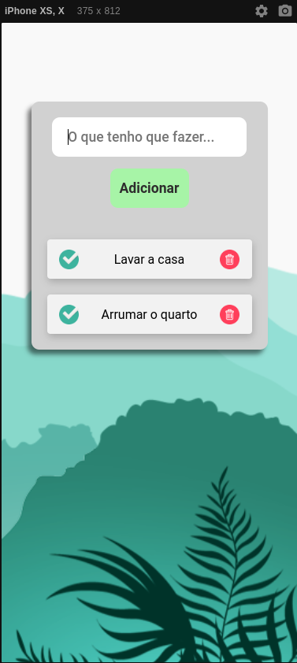

# Sobre Projeto:

Projeto criado para armazenamento de tarefas com o intuito de ajudar a treinar o JavaScript e lembrar de certas tarefas.

## [Link do Projeto](https://willy-braga.github.io/To-do-List/)

### Linguagens e Ferramentas

- HTML
- CSS
- Javascript
- Vscode
- Live Server

## Layout

### Desktop

### Mobile

### Contribua com o projeto

- Realize o Fork
- Faça as modificações necessárias
- Realize a Pull Request (PR)

### Fucionalidades do Projeto

- [x] Adicionar Tarefas
- [x] Salvar Tarefas
- [x] Excluir Tarefas
- [x] Mudar quando a tarefa foi realizada
- [x] Adicionar as tarefas tanto ao clicar no botão "Adicionar" quanto ao clicar no Enter do teclado

### Contribuidores

### Autor

[Licenca MIT License](http://creativecommons.org/licenses/by)
